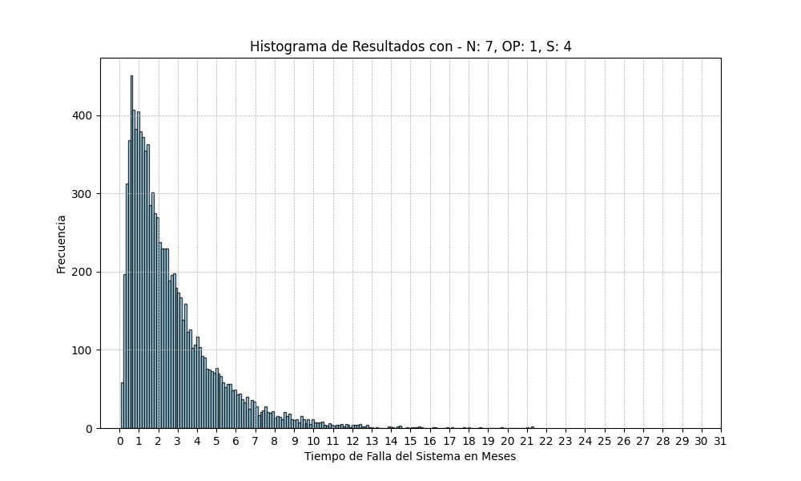

# Trabajo Práctico Especial - Simulación de sistema

## Introducción:
En el presente trabajo se aborda la problemática de maximizar el tiempo de vida del sistema de cajas registradoras de un supermercado. Para ello se simularán los siguientes casos de estudio:

- 1 operario, 7 máquinas en uso y 3 repuestos
- 2 operarios, 7 máquinas en uso y 3 repuestos
- 1 operario, 7 máquinas en uso y 4 repuestos

Se tomarán métricas de los resultados de estos casos (Esperanza, Desviación Estándar) para su posterior análisis y así determinar cuál es el sistema que mejor se adapta a las necesidades del supermercado.

## Algoritmo y descripción de las Variables:

### Constantes y variables utilizadas dentro del algoritmo
- **N**: *Número de cajas registradoras en servicio*
- **S**: *Número de cajas en reserva al inicio de la simulación*
- **OP**: *Número de operarios al inicio de la simulación*
- **available**: *Número de cajas disponibles en un momento dado de la simulación*
- **available_op**: *Operarios disponibles en un momento dado de la simulación*
- **to_repair**: *Cajas a reparar en un momento dado de la simulación*
- **break_moment**: *Lista de los tiempos en los que las cajas en servicio tendrán defectos*
- **repaired_moment**: *Momento en el que los operarios terminan de reparar las cajas defectuosas*
- **sim_time**: *Denota el paso del tiempo dentro de la simulación*
- **min_repair_position**: *Posición del tiempo de reparación más próximo*
- **min_break_position**: *Posición del tiempo de ruptura más próximo*

## Explicación del Algoritmo
Las ideas principales utilizadas para realizar la simulación se basaron en lo provisto por el Capítulo 6 del libro "Simulación" (Segunda Edición) de S. Ross (1999).

- Simulación mediante eventos discretos
- Sistema de línea de espera con un servidor
- Sistema de línea de espera con dos servidores en paralelo

El algoritmo **sistema_rep_gen** simula el tiempo de vida de un sistema de cajas registradoras en un supermercado, considerando el número de operarios y la disponibilidad de repuestos.
Consiste en avanzar en eventos discretos de 2 tipos (ocurrió un desperfecto o se terminó de reparar una caja registradora). En función de cuál es la categoría del próximo evento, se actualizan los valores de las variables de la simulación hasta que se cumplen las condiciones de falla del sistema y devolvemos el valor *sim_time*, el cual representa el tiempo total que duró la simulación.

### Parámetros de Entrada

- N (int): Número de máquinas en uso.
- S (int): Número de repuestos disponibles.
- OP (int): Número de operarios disponibles.

### Variables Iniciales

- **available = N + S**: Cajas disponibles.
- **available_op = OP**: Operarios.

### Cajas a Reparar:

- **to_repair = 0**: Cajas a reparar.

### Tiempos de Falla y Reparación:

- **break_moment = []**: Lista de los tiempos en los que las cajas tuvieron defectos.
- **repaired_moment = []**: Momento en el que los operarios terminan de reparar las cajas.

### Tiempo de Simulación:

- **sim_time = 0**: Denota el paso del tiempo dentro de la simulación.

### Inicialización de Tiempos de Reparación

Para cada operario, se establece un tiempo de reparación infinito inicialmente:

    for _ in range(OP):
        repaired_moment.append(np.inf)

#### Generación de Tiempos de Falla

Se generan N tiempos exponenciales de falla para las máquinas en uso:

    for _ in range(N):
        break_moment.append(-math.log(random()))

#### Bucle Principal de Simulación

El bucle se ejecuta mientras el número de cajas disponibles sea mayor o igual a N:

    while available >= N:

#### Determinación de la Próxima Acción:
Obtenemos los tiempos más próximos de cada tipo de evento, se terminó de reparar una máquina o una máquina sufrió un desperfecto. Luego se comparan esos tiempos para decidir cuál de los dos es el próximo evento a ocurrir en la simulación.

    min_repair_position = repaired_moment.index(min(repaired_moment))
    min_break_position = break_moment.index(min(break_moment))

    if break_moment[min_break_position] <= repaired_moment[min_repair_position]:

#### Si el próximo evento es una falla:
Aumenta el conteo de máquinas a reparar.
Reduce el número de cajas disponibles.
Actualiza el tiempo de simulación y genera un nuevo tiempo de falla para la máquina que se comenzó a utilizar para reemplazar a la que se averió.

    to_repair += 1
    available -= 1
    sim_time = break_moment[min_break_position]
    break_moment[min_break_position] = sim_time - math.log(random())

#### Si el próximo evento es una reparación:
Disminuye el conteo de máquinas a reparar.
Aumenta el número de cajas y operarios disponibles.
Actualiza el tiempo de simulación y establece el tiempo hasta que ese operario termine de reparar la próxima máquina a infinito.

    to_repair -= 1
    available += 1
    available_op += 1
    sim_time = repaired_moment[min_repair_position]
    repaired_moment[min_repair_position] = np.inf

#### Asignación de Reparaciones:

Revisamos si hay operarios disponibles y si el número de máquinas a reparar es mayor que el número de operarios reparando una máquina en el momento.

    if available_op > 0 and (to_repair > OP - available_op):

Si se cumple esta condición tomamos un operario que esté libre (el que tenga el mayor tiempo de reparación ya que este será infinito si no está reparando ninguna máquina) y le asignamos un nuevo tiempo de reparación, reduciendo el número de operarios disponibles.

        max_position = repaired_moment.index(max(repaired_moment))
        repaired_moment[max_position] = sim_time - (1/8 * math.log(random()))
        available_op -= 1

#### Retorno del Resultado

El algoritmo finaliza cuando el número de cajas registradoras disponibles es menor que N y retorna el tiempo de simulación (tiempo en el que el supermercado dejó de ser operativo):

    return sim_time

### Resultados:

A continuación, se presentan los resultados del tiempo hasta que el supermercado deja de ser operativo en meses de 10,000 simulaciones para cada caso de estudio.
Las métricas obtenidas son la esperanza, varianza y desviación estándar para cada caso de estudio y un gráfico con los resultados de las distintas simulaciones:

##### Caso de Estudio 1: 1 Operario, 7 Máquinas en Uso y 3 Repuestos

   - Esperanza: 1.65 meses
   - Varianza: 2.04 meses
   - Desviación Estándar: 1.43 meses

##### Caso de Estudio 2: 2 Operarios, 7 Máquinas en Uso y 3 Repuestos

   - Esperanza: 3.35 meses
   - Varianza: 10.11 meses
   - Desviación Estándar: 3.18 meses

##### Caso de Estudio 3: 1 Operario, 7 Máquinas en Uso y 4 Repuestos

   - Esperanza: 2.60 meses
   - Varianza: 5.06 meses
   - Desviación Estándar: 2.25 meses

A continuación se presenta un gráfico comparativo de las medias y desviaciones estándar de los tiempos de vida del sistema para los tres casos de estudio:

#### Gráfico de Medias y Desviaciones Estándar

#### Análisis de los Resultados

Al comparar los tres casos de estudio, se observan las siguientes características sobresalientes:

- Características Generales:
  - Presentan valores extremos muy alejados de la esperanza.
  - Tienen una alta frecuencia en los valores más bajos del gráfico.

- Caso de Estudio 1:
    - El tiempo de vida promedio del sistema (esperanza) es el más bajo.
    - Su varianza y desviación estándar son relativamente bajas, lo que indica menor variabilidad en los tiempos de vida.

- Caso de Estudio 2:
    - El tiempo de vida promedio del sistema (esperanza) es el más alto.
    - La varianza y desviación estándar son significativamente altas, lo que indica una mayor variabilidad en los tiempos de vida.

- Caso de Estudio 3:
    - El tiempo de vida promedio del sistema (esperanza) es intermedio.
    - La varianza y desviación estándar también son intermedias, indicando una variabilidad moderada en los tiempos de vida.

### Conclusión

El análisis de los resultados muestra que, aunque el sistema con dos operarios y tres repuestos tiene el mayor tiempo de vida promedio, también presenta la mayor variabilidad. Esto podría traducirse en una mayor incertidumbre respecto al tiempo de vida del sistema. Por otro lado, el sistema con un operario y cuatro repuestos ofrece una mejora significativa en el tiempo de vida promedio en comparación con un solo operario y tres repuestos, con una variabilidad moderada.

La elección del sistema óptimo dependerá de las prioridades del supermercado entre maximizar el tiempo de vida del sistema y minimizar la variabilidad e incertidumbre.
