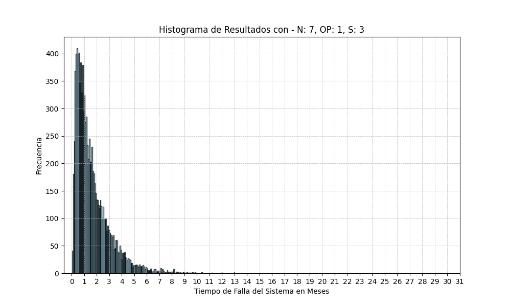
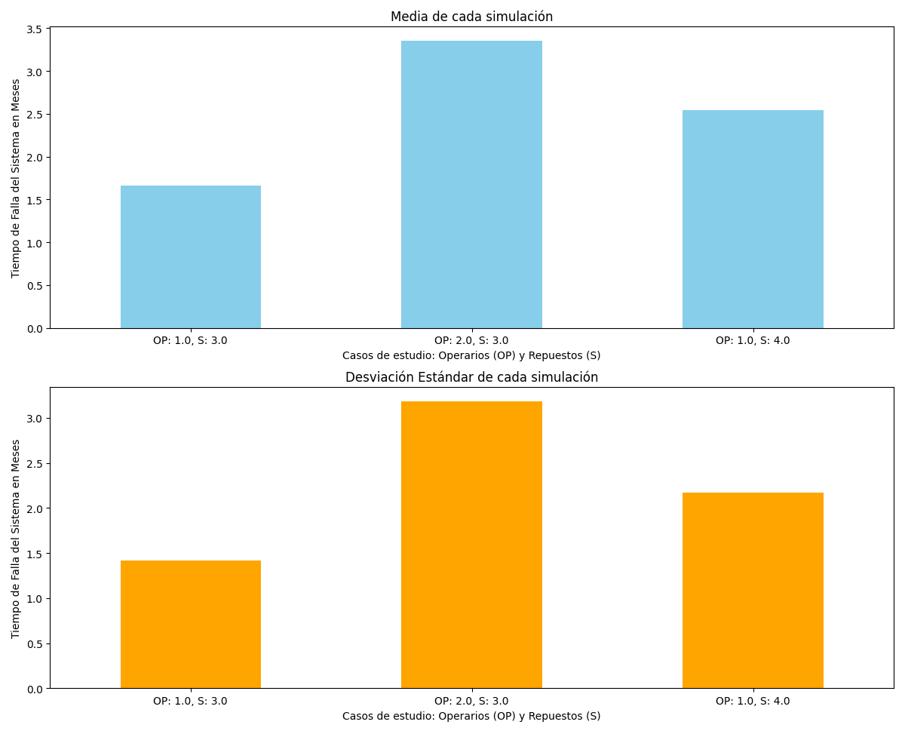

# Trabajo Práctico Especial - Sistema con operarios
## Modelos y Simulación 2024
### Fecha de entrega: 21 de junio de 2024

### Integrantes:
- Hubmann Tomas
- Pereyra Carrillo Juan Cruz
----------------------------------------
## Índice

1. **[Introducción](#introducción)**
    - Contexto del problema
    - Objetivos del trabajo

2. **[Algoritmo y descripción de las Variables](#algoritmo-y-descripción-de-las-variables)**
    - Constantes y variables utilizadas dentro del algoritmo
    - Descripción de las variables
    - Explicación del algoritmo

3. **[Inicialización de Variables](#inicialización-de-variables)**
    - Valores iniciales de las variables
    - Inicialización de tiempos de reparación y de falla

4. **[Bucle Principal de Simulación](#bucle-principal-de-simulación)**
    - Lógica de ejecución del bucle principal
    - Determinación de la próxima acción
    - Manejo de eventos de falla
    - Manejo de eventos de reparación
    - Asignación de reparaciones

5. **[Retorno del Resultado](#retorno-del-resultado)**
    - Condiciones de finalización de la simulación
    - Retorno del tiempo de simulación

6. **[Resultados](#resultados)**
    - Presentación de resultados para cada caso de estudio
    - Caso de Estudio 1: 1 Operario, 7 Máquinas en Uso y 3 Repuestos
    - Caso de Estudio 2: 2 Operarios, 7 Máquinas en Uso y 3 Repuestos
    - Caso de Estudio 3: 1 Operario, 7 Máquinas en Uso y 4 Repuestos

7. **[Análisis de los Resultados](#análisis-de-los-resultados)**
    - Comparación de las métricas obtenidas
    - Características generales de los casos de estudio
    - Análisis de la esperanza, varianza y desviación estándar

8. **[Conclusión](#conclusión)**
    - Resumen de los hallazgos
    - Recomendaciones basadas en los resultados obtenidos
    - Consideraciones sobre la variabilidad e incertidumbre

## Introducción:
En el presente trabajo se aborda la problemática de **maximizar el tiempo de vida del sistema de cajas registradoras de un supermercado.** 
El tiempo de vida del sistema se define como el periodo durante el cual un **supermercado sigue operativo hasta que el número de cajas disponibles cae por debajo de cierto valor**, produciendo así una falla del sistema y quedando inoperante.

Con el fin de lograr esta maximización del tiempo de vida a lo largo de este trabajo analizaremos los siguientes enfoques
* **Incrementar el Número de Operarios**

* **Aumentar la Cantidad de Repuestos**

Para ello se simularán los siguientes casos de estudio:
##### Caso de estudio de control:
-  **1 operario, 7 máquinas en uso y 3 repuestos**
##### Caso de estudio incremento de operarios:
- **2 operarios, 7 máquinas en uso y 3 repuestos**
##### Caso de estudio incremento de repuestos:
- **1 operario, 7 máquinas en uso y 4 repuestos**

Se tomarán métricas de los resultados de estos casos (*Esperanza, Desviación Estándar*) para su posterior análisis y así poder determinar cuál es el sistema que mejor se adapta a las necesidades del supermercado.

## Algoritmo y descripción de las Variables:

### Constantes y variables utilizadas dentro del algoritmo
- **N**: *Número de cajas registradoras en servicio*
- **S**: *Número de cajas en reserva al inicio de la simulación*
- **OP**: *Número de operarios al inicio de la simulación*
- **available**: *Número de cajas disponibles en un momento dado de la simulación*
- **available_op**: *Operarios disponibles en un momento dado de la simulación*
- **to_repair**: *Cajas a reparar en un momento dado de la simulación*
- **break_moment**: *Lista de los tiempos en los que las cajas en servicio tendrán defectos*
- **repaired_moment**: *Momento en el que los operarios terminan de reparar las cajas defectuosas*
- **sim_time**: *Denota el paso del tiempo dentro de la simulación*
- **min_repair_position**: *Posición del tiempo de reparación más próximo*
- **min_break_position**: *Posición del tiempo de ruptura más próximo*

### Explicación del Algoritmo
Las ideas principales utilizadas para realizar la simulación se basaron en lo provisto por el Capítulo 6 del libro "Simulación" (Segunda Edición) de S. Ross (1999).

- **Simulación mediante eventos discretos**
- **Sistema de línea de espera con un servidor**
- **Sistema de línea de espera con dos servidores en paralelo**

El algoritmo **sistema_rep_gen** simula el tiempo de vida de un sistema de cajas registradoras en un supermercado, considerando el numero de cajas registradoras en servicio (**N**),
cuantos operarios se tienen contratados (**OP**) y la cantidad de repuestos (**S**).

La idea general del algoritmo consiste en **simular los tiempos en que ocurren dos tipos de eventos discretos**: 
Una **caja registradora sufre un desperfecto** o una **caja registradora se termina de reparar**. En función de la categoría del próximo evento, se actualizan los valores de las variables de la simulación. **La simulación continúa hasta que el número de cajas disponibles cae por debajo de N**. En ese punto, se devuelve el valor de **sim_time**, que representa el momento en el cual el supermercado deja de ser operativo.

### Inicialización de variables
	avaiable = N + S
	avaiable_op = OP
	to_repair = 0
    break_moment = []
    repaird_moment = []
    sim_time = 0

### Inicialización de Tiempos de Reparación y de Falla

Para cada operario, se establece un **tiempo de reparación infinito** inicialmente, ya que no hay máquinas en reparación al inicio de la simulación. De manera similar, se generan **N tiempos exponenciales** (*con parámetro igual a 1*) de falla para las máquinas en uso.

#### Bucle Principal de Simulación

El bucle se ejecuta mientras el número de cajas disponibles sea **mayor o igual a N**

#### Determinación de la Próxima Acción:
Obtenemos los tiempos más próximos de cada tipo de evento, **se terminó de reparar una máquina o una máquina sufrió un desperfecto**. Luego se comparan esos tiempos para decidir **cuál de los dos es el próximo evento a ocurrir en la simulación.**

##### Si el próximo evento es una falla:

1. Aumenta el conteo de máquinas a reparar.
2. Reduce el número de cajas disponibles.
3. Actualiza el tiempo de simulación y genera un nuevo tiempo de falla para la máquina que se está utilizando como reemplazo de la que se averió.

###### Si el próximo evento es una reparación:

1. Disminuye el conteo de máquinas a reparar.
2. Aumenta el número de cajas y operarios disponibles.
3. Actualiza el tiempo de simulación y establece el tiempo de reparación de la próxima máquina por parte de ese operario como infinito.

#### Asignación de Reparaciones:

Revisamos si hay **operarios disponibles** y si el **número de máquinas a reparar es mayor que el número de operarios ocupados**. Si se cumple esta condición, tomamos un **operario libre** (*el que tenga el mayor tiempo de reparación, ya que este será infinito si no está reparando ninguna máquina*) y le **asignamos un nuevo tiempo de reparación, reduciendo el número de operarios disponibles.**

#### Retorno del Resultado

**El algoritmo finaliza cuando el número de cajas registradoras disponibles es menor que N** y retorna el **tiempo de simulación** denotando el tiempo en el que el supermercado dejó de ser operativo

### Resultados:

A continuación, se presentan los **resultados del tiempo hasta que el supermercado deja de ser operativo en meses de 10,000 simulaciones para cada caso de estudio.**
Las métricas obtenidas son la **esperanza, varianza y desviación estándar** para cada caso de estudio.
- **Características Generales:**
  - Presentan valores extremos muy alejados de la esperanza.
  - Tienen una alta frecuencia en los valores más bajos del gráfico.

##### Caso de Estudio 1: 1 Operario, 7 Máquinas en Uso y 3 Repuestos
- El tiempo de vida promedio del sistema (esperanza) es el más bajo.
- Su varianza y desviación estándar son relativamente bajas, lo que indica menor variabilidad en los tiempos de vida.

   - **Esperanza**: 1.65 meses
   - **Varianza**: 2.04 meses
   - **Desviación Estándar**: 1.43 meses

##### Caso de Estudio 2: 2 Operarios, 7 Máquinas en Uso y 3 Repuestos
- El tiempo de vida promedio del sistema (esperanza) es el más alto.
- La varianza y desviación estándar son significativamente altas, lo que indica una mayor variabilidad en los tiempos de vida.

   - **Esperanza**: 3.35 meses
   - **Varianza**: 10.11 meses
   - **Desviación Estándar**: 3.18 meses

##### Caso de Estudio 3: 1 Operario, 7 Máquinas en Uso y 4 Repuestos

- El tiempo de vida promedio del sistema (esperanza) es intermedio.
- La varianza y desviación estándar también son intermedias, indicando una variabilidad moderada en los tiempos de vida.

   - **Esperanza**: 2.60 meses
   - **Varianza**: 5.06 meses
   - **Desviación Estándar**: 2.25 meses

#### Gráfico de Medias y Desviaciones Estándar

### Conclusión
El análisis de los resultados muestra que, **aunque el sistema con dos operarios y tres repuestos tiene el mayor tiempo de vida promedio, también presenta la mayor variabilidad**. Esto se traduce en una **mayor incertidumbre** respecto al tiempo de vida del sistema, ya que hay casos donde que se **rompan máquinas en tiempos próximos** al principio de la simulación puede causar que el **tiempo de vida del sistema sea menor a 1 mes**. A su vez hay casos en los que **las rupturas están lo suficientemente distanciadas** para que los operarios mantengan el sistema libre de fallas logrando un **tiempo de vida de hasta 30 meses**. Por otro lado, el **sistema con un operario y cuatro repuestos**, al tener una **desviación estándar menor**, nos da la capacidad de dar un **intervalo más acotado para el tiempo de vida** que puede alcanzar el supermercado y por lo tanto, la estimación tendrá **mayor certeza**.

Analizar detalladamente las métricas obtenidas de las simulaciones (esperanza, varianza y desviación estándar) puede ofrecer "insights" sobre la relación entre los recursos (operarios y repuestos) y el rendimiento del sistema. Con estos datos, se pueden ajustar los parámetros para encontrar el balance óptimo que maximice el tiempo de vida del sistema con la menor variabilidad.

Si nos guiáramos solo por el tiempo de vida promedio del sistema, la mejor elección sería el sistema con 2 operarios. Pero al tener en cuenta la varianza que presentan los dos sistemas, hace que la elección de añadir un operario o aumentar en uno los repuestos dependerá de las prioridades del supermercado entre maximizar el tiempo de vida del sistema que se puede llegar a alcanzar y minimizar la variabilidad e incertidumbre de la duración.
